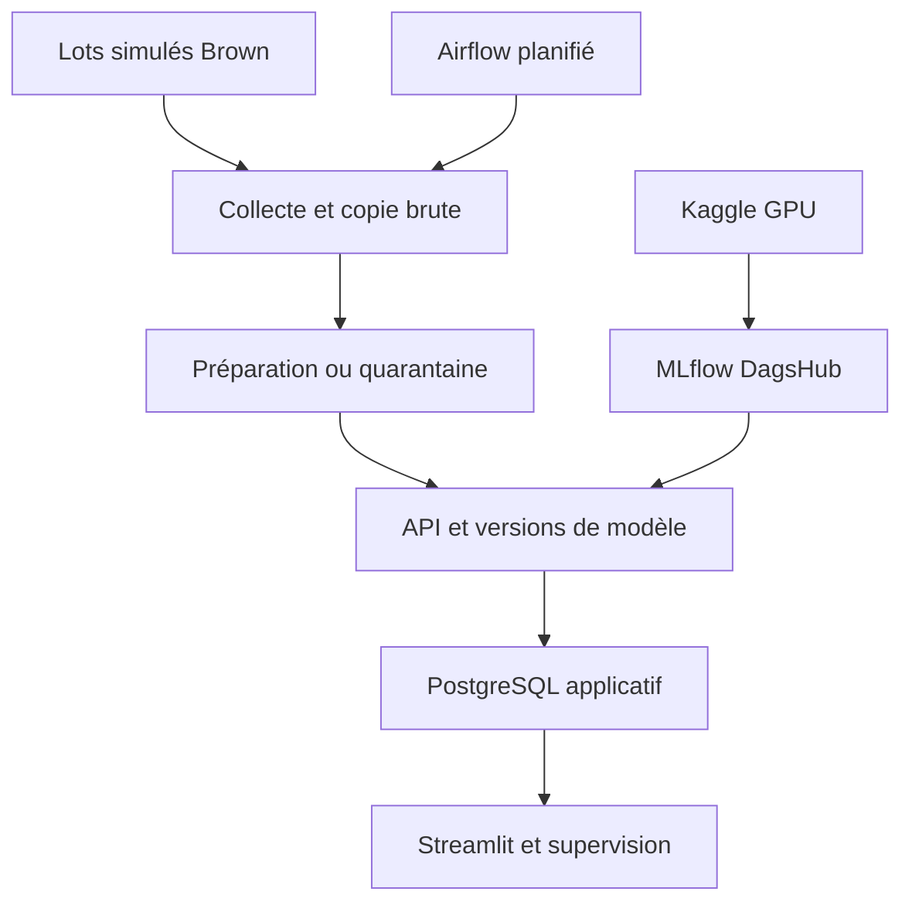
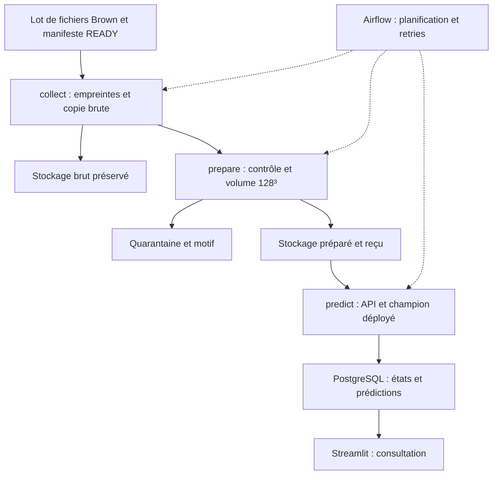

# ADHD200 — pipeline compact pour les blocs 3 et 4

Version de livraison : 6 octobre 2026. Ce projet sert une démonstration de recherche : une IRM anatomique arrive, ses contrôles et sa préparation sont exécutés, un modèle versionné produit un score, ce résultat est stocké et consulté. Il n'assiste aucune décision médicale et ne constitue pas un outil diagnostique validé.

Cette version remplace le squelette de 126 fichiers (29 renseignés, 97 vides) par un ensemble de modules opérationnels, configurations, tests et documents. Les historiques de données restent dans `~/ADHD200_DATA` ; l'ancien code est archivé par l'installateur. Aucun fichier vide n'est présenté comme une fonctionnalité réalisée.

## Ce qui est livré et ce qui doit être exécuté

| Élément | Contenu livré | Preuve à recueillir sur WSL/Kaggle |
| --- | --- | --- |
| Préparation | Même recette générale, contrôles renforcés, reçus et signatures | Compatibilité avec l'export existant, reprise et retraitement |
| Apprentissage | Deux CNN, AdamW, accumulation, AMP, scheduler, arrêt et reprise | Calcul GPU/AMP, quatre essais, décision d’arrêt documentée et interruption réelle |
| Traçabilité | SHA-256, profil, poids, référence train, model card, MLflow | Expériences et versions réellement visibles sur DagsHub |
| Airflow | Deux DAGs planifiés, dépendances et relances | Exécution planifiée, panne, reprise et corruption filmées |
| API/SQL/dashboard | Inférence unitaire et par lot, modèle en mémoire, PostgreSQL et Streamlit | Tests Docker, premier résultat réel, latence et charge |
| Mise à jour | Canary réel 10 %, barrières de promotion, rollback, alias MLflow | Candidat entraîné, requêtes observées, promotion et rollback |
| Supervision | Dérive descriptive, performances avec vraies cibles, alerts persistantes | Fenêtres et cibles disponibles, seuils discutés |
| Réentraînement | Snapshot admissible, nouveau paquet, soumission Kaggle et workflow | Accès distant configuré, revue de transfert, quotas et nouveaux labels |
| CI/CD | Tests sur GitHub, déploiement local conditionné aux tests | Dépôt GitHub et runner WSL privé enregistrés |

L'écriture du code ne constitue pas une preuve d'exécution. Quatre essais réels ont depuis été réalisés : leur meilleure ROC-AUC de validation est de 0,5885 et 0,6162 pour SimpleCNN3D, et de 0,7038 et 0,6278 pour ResNet3D (taux initiaux respectifs 0,001 et 0,0003). Le champion retenu avant l'évaluation finale est ResNet3D, taux 0,001, version MLflow 3. Le détail des 41 indicateurs et de leurs preuves est dans [docs/jury.md](docs/jury.md). Aucun paquet logiciel ne peut garantir la décision du jury.

## Architecture retenue



Airflow transmet des références, jamais les millions de voxels dans XCom. Le worker exécute le calcul CPU ; les jobs et leases sont persistants dans PostgreSQL. L'API charge au plus deux versions de modèle et limite concurrence et lots. DagsHub ne remplace pas la base applicative. GitHub est nécessaire pour le code et la CI demandés ; le même historique peut être poussé vers DagsHub.

Le traitement est un ETL par petits lots : aucun besoin établi de Kafka ou de streaming à la milliseconde. Cadence de démonstration choisie : cinq minutes ; alerte de délai : vingt minutes. Ce sont des hypothèses de projet à mesurer, pas des chiffres imposés par l'école. Les arrivées sont simulées et annoncées comme telles.

## Modules utiles

| Fichier | Responsabilité |
| --- | --- |
| `adhd/utils.py` | Fichiers atomiques, chemins sûrs, secrets, HTTP et DB |
| `adhd/identity.py` | Pseudonymisation HMAC : appliquée à la collecte des arrivées et au rapprochement historique |
| `adhd/intake/` | Étapes amont du trajet historique : contrôle technique, liste acceptée, rapprochement des diagnostics, audit des biais, répartition |
| `adhd/costs.py` | Estimation des coûts à partir des durées mesurées et des tarifs de `configs/service.yaml` |
| `adhd/data.py` | Préparation commune aux volumes historiques et arrivées |
| `adhd/historical.py` | Retraitement historique versionné et reprise |
| `adhd/export.py` | Export local train/validation sans tests |
| `adhd/learning.py` | Lecteur, architectures, métriques et calcul d'une époque |
| `adhd/train.py` | Coordination GPU, checkpoints et reprise |
| `adhd/cli.py` | Contrôles, Kaggle, publication, import, simulation et tests finaux |
| `adhd/flow.py` | Collecte, préparation, prédiction, surveillance et worker |
| `adhd/service.py` | API, labels, canary, promotion et rollback |
| `adhd/dashboard.py` | Présentation des résultats et supervision |
| `dags/pipeline.py` | Deux DAGs planifiés |

Les étapes amont (contrôle technique, liste acceptée, rapprochement des diagnostics avec pseudonymisation, audit des biais, répartition) font partie de ce dépôt : `adhd/intake/`, lancées par `python -m adhd.cli intake <étape>` dans le service `history`. Ce sont les programmes qui ont produit les rapports privés utilisés ici, repris sans changement de logique. Leur réexécution dans cette image reste à vérifier ; elle créerait de nouveaux rapports sans modifier les anciens.

## Données et décisions conservées

Inventaire historique communiqué : 1 254 NIfTI, dont 961 candidats anatomiques et 293 REST hors du périmètre anatomique. Une image OHSU `(46,240,256)` avec une étendue déclarée atypique est en quarantaine logique : source inchangée, réparation non inventée. Restent 960 patients distincts, dont 934 étiquetés (575 témoins, 359 ADHD) et 26 Brown sans diagnostic exploitable.

La cible binaire regroupe DX `1`, `2`, `3` en ADHD ; `0` signifie témoin ; vide/pending signifie inconnu. Référence : [clé phénotypique officielle](https://fcon_1000.projects.nitrc.org/indi/adhd200/general/ADHD-200_PhenotypicKey.pdf). L'intégrité technique ne valide ni la qualité médicale ni les conditions de réutilisation.

Protocole `center_holdout_internal_v2`, graine 42, inchangé :

| Groupe | Patients | Témoins | ADHD | Centres |
| --- | ---: | ---: | ---: | --- |
| Train | 563 | 336 | 227 | KKI, NYU, OHSU, PEK, Pittsburgh |
| Validation | 119 | 71 | 48 | Idem |
| Test interne | 119 | 71 | 48 | Idem |
| Test externe | 73 | 37 | 36 | NeuroIMAGE |
| Témoins externes | 60 | 60 | 0 | WashU |
| Arrivées réservées | 26 | — | — | Brown |

Les exclusions de modalité, quarantaines, réservations de centres et exclusions de Git ont des raisons distinctes. Aucune ne supprime les sources. Le registre historique est conservé dans [docs/decisions.md](docs/decisions.md), complété par les décisions de cette livraison.

Pittsburgh reste dans le développement malgré quatre ADHD sur 98. Ce choix conserve des données mais peut renforcer l'effet du centre : une étude de sensibilité avec/sans Pittsburgh doit utiliser exclusivement le développement. WashU mesure les faux positifs, pas la sensibilité. NeuroIMAGE combine différences de centre et d'âge. Les réservations sont des choix expérimentaux, pas des exclusions imposées par le jury.

## Préparation, protection et contrat

RAS → espacement intermédiaire 1 mm → recadrage non nul → percentiles 1/99 → intensités [0,1] → plus grand axe à 128 → marges jusqu'à 128³. L'échelle physique finale varie ; ce n'est ni un recalage anatomique, ni une extraction du cerveau, ni un retrait du visage.

La nouvelle version fixe les labels d'orientation explicitement et refuse unités non mm, affines invalides et étendues supérieures à 500 mm. Ce dernier seuil est un garde-fou technique de projet, pas une norme médicale. Le contrat lie recette, code, données exportées et modèle. Un contrôle de compatibilité est imposé avant réutilisation de l'ancien export.

Les originaux sont montés en lecture seule. Les identifiants sont pseudonymisés par HMAC avec une clé hors du code (`adhd/identity.py`). Pour les arrivées, le lot fournit le numéro de dossier et l'étape de collecte le remplace par son code : seul le code est enregistré en base, et un identifiant en clair est refusé. Les lots Brown déjà reçus transportaient un code calculé en amont, toujours accepté ; le dashboard affiche des empreintes techniques. Les empreintes binaires et numériques repèrent certaines répétitions, pas toutes les conversions d'une même acquisition.

Le paquet Kaggle actuel contient seulement 563 train +119 validation, tableaux float32 128³, environ 2,66 Gio. La protection faciale de l’ensemble des volumes n’est pas certifiée par ce code : **le seul contrôle d’intégrité ne vaut pas autorisation de transfert**. Les aperçus examinés sont compatibles avec un masquage source, sans preuve exhaustive d’anonymisation. Voir la revue et les conditions de transfert dans [docs/operations.md](docs/operations.md).

## Installation et étapes de lancement

Extraire cette livraison dans un dossier distinct du projet actif, puis :

```bash
python3 deploy.py install
```

L'installateur construit une **nouvelle image Docker CPU**, contrôle les tests dans une base séparée et importe les DAGs avant d'archiver l'ancien code. Il démarre ensuite Docker, Airflow, l'API et Streamlit. Les services peuvent être accessibles avant qu'un modèle existe ; `/ready` retourne alors 503. Aucun faux champion n'est fabriqué.

**Kaggle commence ensuite**, après contrôle du paquet et de sa protection, activation du GPU et configuration des secrets. Le détail des commandes, de l'import du modèle et de la simulation Brown est dans [docs/operations.md](docs/operations.md).

## Optimisation et évaluation

Référence initiale : SimpleCNN3D 73 097 paramètres et ResNet3D compact 227 401, base 8, GroupNorm, dropout 0,20 ; AdamW avec biais/normalisation sans decay, taux 0,001 et 0,0003, BCE pondérée train uniquement (`336/227≈1,4802`), batch 2 avec accumulation 4, clip 1, précision adaptée au GPU, scheduler et arrêt sur ROC-AUC validation, maximum 40 époques. L'accumulation utilise le nombre réel d'images du dernier groupe incomplet.

Ces valeurs ne sont pas des paramètres déjà optimisés. La campagne est arrêtée à quatre essais ; les confirmations multi-graines ne sont pas réalisées à ce stade. La décision et ses limites sont documentées ci-dessous. Les tests finaux ne servent jamais à choisir le modèle, le seuil ou le protocole. La commande `holdout` mesure les groupes réservés après gel des choix.

ROC-AUC, average precision, matrice de confusion, balanced accuracy, sensibilité, spécificité, F1 et Brier sont disponibles globalement et par centre. Une métrique impossible est `None`, jamais inventée. Une règle toujours témoin atteint environ 59,66 % d'accuracy sur la validation, mais 50 % de balanced accuracy et zéro sensibilité. Les scores pondérés ne sont pas automatiquement calibrés.

L'explication par gradient×entrée mesure une sensibilité locale ; elle ne prouve pas la cause du TDAH. La dérive des entrées est séparée de la performance avec cibles réelles. Les répétitions de requêtes ne créent pas des patients statistiques supplémentaires.

## Limites et preuve d'achèvement

La certification demande code, présentation et preuve de fonctionnement. Elle ne s'obtient pas par un nombre de fichiers. Le mode Airflow livré est une démonstration locale ; une exposition publique ou un usage clinique nécessiterait une architecture et une analyse supplémentaires.

Versions principales fixées et versions résolues enregistrées dans `/app/environment.lock.txt` : un verrouillage intégral avec hashes et digests d'images reste une amélioration de reproductibilité. Les dépendances Kaggle et CUDA sont enregistrées par expérience ; leur identité avec Docker CPU n'est ni exigée ni prétendue.

Les tests purs et contrôles statiques réalisés pendant la fabrication sont consignés dans `docs/verification.json`. La suite CPU/API/PostgreSQL et l'import Airflow sont fournis et exécutés par l'installateur sur WSL. Les entraînements, transferts, CI distante, montée en charge, reprise GPU et vidéos restent des exécutions à réaliser avec les comptes et données d'Olivier.

## Décision : arrêt de la campagne initiale après quatre essais

Deux architectures et deux taux d’apprentissage ont été comparés avec
la graine 42. Nous ne réalisons pas de répétitions multi-graines à ce stade :
la priorité est la validation du pipeline complet et les preuves de certification.

La validation comprend 119 patients, avec de faibles effectifs dans certains
centres. Changer la graine ne corrigerait ni cette limitation ni les déséquilibres
entre centres. Des répétitions permettraient néanmoins d’étudier la variabilité
de l’apprentissage ; celle-ci reste non mesurée.

ResNet3D à 0,001, version MLflow 3, est retenu pour la démonstration.
ResNet3D à 0,0003, version 4, est retenu comme challenger actif potentiel.
SimpleCNN3D à 0,0003 reste une référence comparée, exclue de la mise en
service car ses prédictions sont toutes « témoin » au seuil 0,5.

Les seuils d’éligibilité sont des choix du projet, pas des exigences du jury.
Le refus des prédictions constantes est ajouté après analyse de la campagne :
il ne s’agit pas d’une règle expérimentale annoncée avant les entraînements.

Aucune supériorité statistique ni validation clinique n’est revendiquée.
Le seuil reste fixé à 0,5. Les choix sont gelés avant l’évaluation finale
sur les tests réservés ; leurs résultats ne serviront pas à régler le modèle.

## Vocation architecturale et portée scientifique

Ce projet vise principalement à démontrer, pour la certification des blocs
3 et 4, une architecture MLOps fonctionnelle et traçable : préparation des
données, comparaison de modèles, versionnement, déploiement, orchestration,
surveillance et reprise après incident. Ces capacités doivent être étayées
par des preuves d’exécution ; leur présence dans le code ne suffit pas.

Sur le plan scientifique, répéter les entraînements avec plusieurs graines
permettrait de mesurer la variabilité liée à l’initialisation et aux tirages
aléatoires. Cette démarche conserve son intérêt, même avec un petit
échantillon ; elle ne compense toutefois ni le faible nombre de patients
de validation ni les déséquilibres entre centres.

Nous avons arrêté la campagne à quatre essais avec la graine 42, afin de
consacrer les ressources restantes à la vérification de l’architecture
complète. Nous avons renoncé aux répétitions multi-graines à ce stade,
pas à l’utilisation d’une graine fixée pour la reproductibilité.

Ce choix de périmètre laisse la variabilité de l’apprentissage non mesurée.
Les résultats constituent une comparaison exploratoire pour sélectionner
un modèle de démonstration, sans établir une supériorité statistique,
une robustesse clinique ou une aptitude au diagnostic.

## Déploiement piloté par les alias du registre

Les alias DagsHub/MLflow `champion` et `challenger` désignent les versions
souhaitées. Le déploiement les lit, télécharge les paquets `deployment`,
contrôle manifeste, poids, recette et éligibilité, puis publie atomiquement
l’état local utilisé par l’API. Aucun téléchargement n’a lieu par prédiction.

La copie locale permet de continuer l’inférence si le registre est indisponible.
Le contrôle planifié distingue `aligned`, `mismatch` et `registry_unavailable`.
Les deux derniers états produisent des alertes ; ils ne remplacent pas le modèle.
Un changement d’alias doit être suivi de la commande de déploiement : il n’est
pas pris en compte instantanément par l’API.

`catalog_challenger` conserve le candidat du registre. `challenger` et `fraction`
décrivent seulement le trafic canary actif. Un candidat peut donc être présent
avec une fraction de zéro. Une promotion normale conserve les barrières de
validation et de canary, puis actualise le registre avant de déployer.

Commandes :
- `python3 deploy.py cli` reste disponible pour les autres fonctions.
- `docker compose run --rm --no-deps worker python -m adhd.registry_deployment deploy`
- `docker compose run --rm --no-deps worker python -m adhd.registry_deployment check`
- `docker compose run --rm --no-deps worker python -m adhd.registry_deployment restore-exercise`

L’exercice temporaire version 4 puis version 3 est déclaré technique. Il ne
constitue ni une promotion scientifique ni un réglage après lecture des tests.
Il vérifie deux inférences et la restauration de l’alias et du modèle servi.
Le jeton local demeure hors du dépôt, sans affichage dans les journaux.

<!-- BLOC3_CONSOLIDATION_START -->
## Bloc 3 — état consolidé au 7 octobre 2026

Les tableaux de livraison initiale décrivent le contenu fourni, pas l'état actuel des preuves. La matrice détaillée est désormais dans [docs/bloc3_cloture.md](docs/bloc3_cloture.md). Le déroulé préparatoire est dans [docs/bloc3_video.md](docs/bloc3_video.md).

Le premier lot Brown a produit trois prédictions réelles et une quarantaine de fichier artificiellement corrompu. Un exercice distinct a montré une panne temporaire de l'API, l'état Airflow `up_for_retry`, une deuxième tentative réussie puis la fin du même DAG run. Une nouvelle livraison d'un fichier identique a été neutralisée sans nouvel élément ni nouvelle prédiction. Les rapports datés restent dans `ADHD200_DATA/reports/compact` ; aucune IRM ou correspondance privée n'est incorporée au dépôt de code.

### Architecture des arrivées



Le trajet est un traitement batch local, toutes les cinq minutes, pour un usage de recherche et de démonstration. Ce rythme est un choix d'architecture, pas un engagement clinique de temps réel. Les sources sont conservées ; l'isolation d'une erreur et l'exclusion Git ne suppriment pas les originaux. La déduplication repose sur l'empreinte du fichier : une reconversion peut nécessiter un contrôle supplémentaire. Les clés et les données restent hors du code publié.

Les contrôles acquis ne signifient pas que le bloc est entièrement validé : retraitement historique isolé, reproductibilité, visibilité des alertes, coûts, publication GitHub, support et vidéo restent à clôturer selon la matrice. Le jury apprécie les livrables et les justifications.
<!-- BLOC3_CONSOLIDATION_END -->

## Revue du code installé — 7 octobre 2026

La revue du ZIP de 37 fichiers a confirmé la préparation commune historique/arrivées, les signatures, la réutilisation contrôlée des sorties, les secrets externalisés et les workflows GitHub présents. Cinq tests NumPy/stdlib ont été exécutés lors de cette revue et ont réussi ; les 16 tests Docker précédemment réussis sur WSL constituent une preuve distincte. La présence des workflows ne prouve pas leur exécution sur GitHub. Les rapports `b3_final_checks_*` décrivent le périmètre réellement démontré par les contrôles complémentaires.

Depuis le 7 octobre, le code amont de pseudonymisation et de rapprochement est intégré au dépôt (`adhd/identity.py`, `adhd/intake/`). Ni la clé ni les correspondances privées ne sont publiées. Trois points restent à confirmer par exécution sur WSL : les tests Docker, l'égalité des codes recalculés (`python deploy.py cli identity-check <répartition privée>`) et un lot réel fournissant des numéros de dossier.
