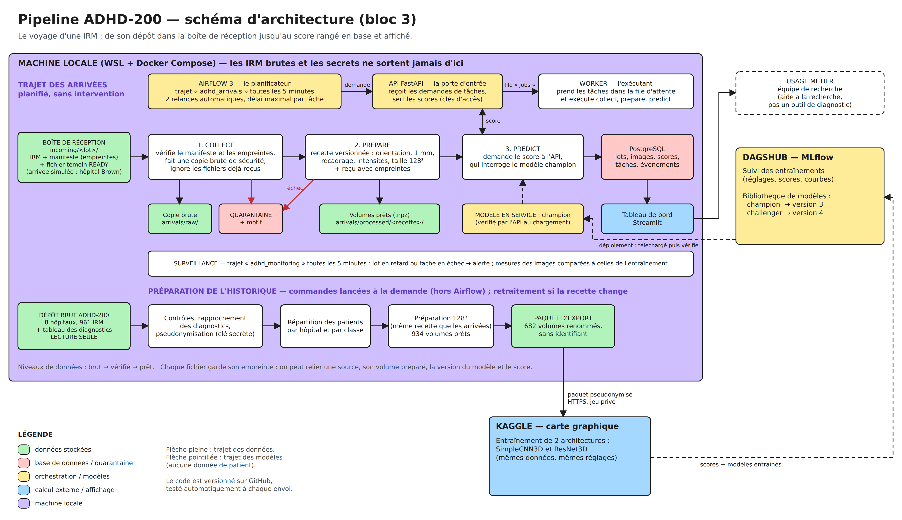
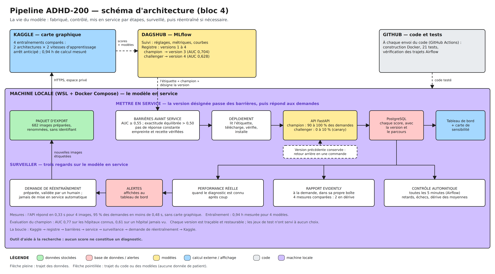

# ADHD-200 — pipeline de données et mise en service d'un modèle d'IRM

> **Outil d'aide à la recherche. Ce n'est pas un dispositif de diagnostic.**
> Projet de certification « Architecte en intelligence artificielle » (RNCP41993), blocs 3 et 4.

Ce dépôt contient un pipeline qui reçoit des IRM cérébrales par lots, les contrôle, protège l'identité des patients, prépare les images, demande un score à un modèle et range le résultat dans une base de données. Tout est lancé automatiquement, toutes les 5 minutes, par un orchestrateur (Airflow).

**Aucune donnée ni aucun mot de passe ne se trouve dans ce dépôt.** Les IRM restent dans un dossier séparé, sur la machine.

## Schéma d'architecture



Ce premier schéma suit le trajet d'une IRM. Un second suit la vie du modèle : entraînement, registre, mise en service par étapes, surveillance, réentraînement.



## Le trajet d'une IRM

Un hôpital dépose un lot dans la boîte de réception (`incoming/`). Toutes les 5 minutes, Airflow lance trois tâches. Chacune attend la réussite de la précédente.

| Tâche | Ce qu'elle fait | Si un fichier pose problème |
| --- | --- | --- |
| `collect` | Vérifie la fiche du lot et l'empreinte de chaque fichier, garde une copie brute, ignore les fichiers déjà reçus, **remplace le numéro de dossier par un code** | Le lot non conforme est écarté et une alerte est émise |
| `prepare` | Met chaque image au format attendu par le modèle (orientation, résolution, intensités, taille 128³) | Le fichier part en quarantaine avec son motif ; les autres continuent |
| `predict` | Demande un score à l'API, qui interroge le modèle « champion » | La tâche est relancée automatiquement |

Le score est enregistré dans PostgreSQL, puis affiché dans le tableau de bord. Un second trajet, `adhd_monitoring`, surveille les retards, les échecs et l'évolution des images reçues.

## Les services

Tout tourne en local, dans Docker. Les services ne sont joignables que depuis la machine.

| Service | Rôle | Adresse | Origine |
| --- | --- | --- | --- |
| `airflow` | Lance les trajets à heure fixe, relance en cas de panne | http://localhost:8080 | Logiciel existant |
| `postgres` | Base de données : lots, images, scores, tâches, événements | interne | Logiciel existant |
| `api` | Reçoit les demandes de tâches, sert les scores | http://localhost:8000/docs | Code de ce dépôt |
| `worker` | Exécute les tâches `collect`, `prepare`, `predict` | interne | Code de ce dépôt |
| `dashboard` | Tableau de bord | http://localhost:8501 | Code de ce dépôt |
| `drift-report` | Rapport de dérive Evidently, lancé à la demande | aucune | Code de ce dépôt, dans sa propre image |
| `history` | Étapes amont de l'historique, lancées à la demande | aucune | Code de ce dépôt |

Deux services extérieurs complètent l'ensemble : **Kaggle** pour l'entraînement sur carte graphique, à partir d'un paquet sans identifiant, et **DagsHub (MLflow)** pour ranger les modèles et désigner le champion.

## Organisation du dépôt

| Emplacement | Contenu |
| --- | --- |
| `dags/pipeline.py` | Les deux trajets Airflow : arrivées et surveillance |
| `adhd/flow.py` | Les tâches : collecte, préparation, prédiction, surveillance |
| `adhd/identity.py` | Pseudonymisation des identités, avec une clé secrète |
| `adhd/data.py` | Recette de préparation des images, commune à l'historique et aux arrivées |
| `adhd/service.py` | L'API : tâches, scores, changement de modèle |
| `adhd/dashboard.py` | Le tableau de bord |
| `adhd/costs.py` | Estimation des coûts à partir des durées mesurées |
| `adhd/drift_report.py`, `Dockerfile.evidently` | Rapport de dérive Evidently, dans sa propre boîte Docker |
| `adhd/intake/` | Étapes amont de l'historique : contrôles, rapprochement des diagnostics, répartition des patients |
| `adhd/historical.py`, `adhd/export.py` | Préparation des images d'entraînement et paquet pour Kaggle |
| `adhd/learning.py`, `adhd/train.py` | Les deux architectures (SimpleCNN3D, ResNet3D) et leur entraînement |
| `adhd/registry_deployment.py` | Lien entre le registre de modèles et le modèle servi |
| `configs/` | Réglages : recette, rôles des hôpitaux, entraînement, seuils et tarifs |
| `compose.yaml`, `Dockerfile` | L'installation complète |
| `tests/` | 21 tests automatiques |
| `.github/workflows/` | Tests lancés à chaque envoi du code ; demande de réentraînement |
| `docs/` | Documentation détaillée |

## Installer et lancer

Prérequis : Linux ou WSL, Python 3, Docker avec Docker Compose, et un dépôt de données contenant le dossier `raw/`.

Télécharger le dépôt dans un dossier de travail, puis, depuis ce dossier :

```bash
python3 deploy.py install --target "$HOME/ADHD200_PIPELINE" --data "$HOME/ADHD200_DATA"
```

L'installateur copie le projet dans le dossier cible, crée les mots de passe (hors du dépôt), construit l'image Docker, lance les tests, puis démarre les services. Ensuite :

```bash
python3 deploy.py status             # état des services
python3 deploy.py test               # relancer les tests
python3 deploy.py airflow-password   # identifiants de l'interface Airflow
docker compose up -d                 # redémarrer les services
```

Le détail (entraînement sur Kaggle, import d'un modèle, sauvegardes) est dans [docs/operations.md](docs/operations.md).

## Faire une démonstration

```bash
# Déposer un lot simulé : 3 IRM de l'hôpital WashU et un fichier volontairement abîmé
SPLIT=$(ls "$HOME/ADHD200_DATA/reports/private"/split_private_*.json | tail -1)
python3 deploy.py cli simulate /data/reports/private/$(basename "$SPLIT") --site WashU --size 3 --corrupt
```

Airflow prend le lot en charge à son prochain passage. Le tableau de bord affiche alors trois images prédites de plus et un fichier en quarantaine. L'arrivée est simulée ; tout le reste du traitement est réel.

```bash
# Le dossier des IRM d'origine est en lecture seule : cette commande doit être refusée
docker compose exec worker touch /data/raw/essai.txt
```

## Protection des données

- **Pseudonymisation dans le flux.** Le numéro de dossier est remplacé par un code dès la collecte, par HMAC-SHA256 avec une clé secrète. Seul le code entre en base ; un identifiant en clair est refusé. Ce n'est pas une anonymisation : avec la clé, le lien reste possible.
- **Secrets hors du code.** Clé, mots de passe et jetons sont des fichiers montés dans les conteneurs ; aucun n'est suivi par Git.
- **IRM d'origine en lecture seule** pour tous les programmes.
- **Transferts.** Seul un paquet d'images préparées, renommées et sans identifiant part vers Kaggle, en HTTPS, dans un espace privé.
- **Limite.** Le pipeline ne retire ni le crâne ni le visage des images.

## Qualité et robustesse

- Contrôle du manifeste et de l'empreinte de chaque fichier à l'entrée.
- Quarantaine avec motif, sans blocage des autres images.
- Deux relances automatiques par tâche, à 30 secondes d'intervalle.
- Aucun doublon : un fichier déjà reçu est reconnu par son empreinte.
- 21 tests automatiques, lancés dans Docker et sur GitHub à chaque envoi du code.

## Modèles

Deux architectures ont été comparées, chacune avec deux réglages : quatre entraînements, enregistrés dans MLflow sous un même nom. Des étiquettes désignent les versions utiles :

| Étiquette | Version | Architecture | AUC de validation |
| --- | --- | --- | --- |
| `champion` (en service) | 3 | ResNet3D | 0,704 |
| `challenger` | 4 | ResNet3D | 0,628 |

Un modèle qui répond toujours la même chose est refusé. Un challenger peut recevoir une part des demandes (10 %) avant une éventuelle promotion, et l'ancien champion peut être restauré.

Le champion a ensuite été noté une seule fois sur les images jamais vues. Ces jeux de test n'ont servi à aucun choix.

| Groupe | Images | AUC | Sensibilité | Spécificité |
| --- | --- | --- | --- | --- |
| Test interne (hôpitaux connus) | 119 | 0,774 | 0,750 | 0,676 |
| Test externe (NeuroIMAGE, jamais vu) | 73 | 0,615 | 0,694 | 0,595 |
| Témoins externes (WashU, jamais vu) | 60 | — | — | 0,433 |

Le détail, hôpital par hôpital, et les limites sont dans la [fiche du modèle](docs/model_card.md).

## Changer de modèle

Le registre MLflow fait foi : c'est l'étiquette `champion` du modèle `ADHD200_ANATOMICAL` qui désigne la version à servir. Changer de modèle ne demande aucune modification du code.

```bash
# Le modèle servi correspond-il à l'étiquette du registre ?
docker compose run --rm worker python -m adhd.registry_deployment check

# Installer la version désignée par l'étiquette : téléchargée, vérifiée, puis servie
docker compose run --rm worker python -m adhd.registry_deployment deploy

# Exercice de retour arrière : passer sur la version du challenger, puis revenir au champion
docker compose run --rm worker python -m adhd.registry_deployment restore-exercise
```

Avant d'être servie, une version doit franchir les barrières de `configs/service.yaml` : classement minimal, décision non constante, fichier et recette de préparation vérifiés. Un challenger peut d'abord recevoir 10 % des demandes. Il n'est promu que s'il égale le champion, sans erreur ni lenteur. Chaque changement est inscrit dans un journal, visible dans l'onglet « Modèles » du tableau de bord. Si le modèle servi ne correspond plus à l'étiquette, une alerte est émise.

## Surveillance et coûts

Chaque tâche enregistre sa durée et sa mémoire. Le pipeline en tire une estimation de coût, avec des tarifs déclarés comme hypothèses dans `configs/service.yaml`. Une alerte est émise si un lot tarde, si une tâche échoue, ou si les images reçues s'écartent de celles de l'entraînement.

La dérive est suivie à deux niveaux :

- **un contrôle simple, automatique**, toutes les 5 minutes : il compare la moyenne de quatre mesures des images reçues à celle de l'entraînement ;
- **un rapport Evidently, à la demande** : il compare la répartition complète de ces mesures et produit un rapport illustré.

```bash
docker compose --profile monitoring run --rm drift-report
```

Le rapport est écrit dans `reports/compact/evidently/` et résumé dans le tableau de bord.

## Résultats observés au 7 octobre 2026

| Mesure | Valeur |
| --- | --- |
| Lots reçus | 10 |
| Images prédites | 36 |
| Fichiers mis en quarantaine | 3 |
| Passages du trajet des arrivées | 177 |
| Temps de calcul cumulé | environ 6 minutes |
| Coût local estimé | 0,002 € |
| Réponse de l'API pour 4 images, sur processeur | 0,33 s ; 95 % des demandes en moins de 0,48 s |
| Entraînement des 4 modèles | 0,94 h mesurée (88 époques), environ 1 h 30 de session sur Kaggle |
| Dérive selon le contrôle simple (36 images) | non détectée |
| Dérive selon Evidently (36 images contre 563) | détectée sur 2 mesures sur 4 : part occupée, zones claires |

## Décisions et enseignements

### Les décisions d'architecture

| Décision | Choix retenu | Alternative écartée, et pourquoi |
| --- | --- | --- |
| Mode de traitement | Par lots, toutes les 5 minutes | Temps réel : aucune réponse n'est attendue à la seconde |
| Orchestration | Airflow | Kafka, fait pour un flux continu ; un simple minuteur, sans relances ni historique |
| Hébergement | Local, dans Docker | Cloud : les IRM brutes de mineurs restent sur la machine ; coût nul |
| Exécution des tâches | Une API qui reçoit, un worker qui exécute, une file d'attente en base | Calcul dans Airflow : les demandes ne doivent pas se perdre si le calcul est occupé |
| Protection des identités | Pseudonymisation par clé, appliquée dès la collecte | Pseudonymisation en amont, hors du pipeline : le code devait la porter lui-même |
| Arrivées de démonstration | Hôpitaux réservés (Brown, WashU), jamais utilisés à l'entraînement | Télécharger d'autres IRM : le modèle aurait appris à reconnaître la collection |
| Rôle des hôpitaux | Cinq pour apprendre, NeuroIMAGE pour un test externe, WashU en témoins externes | Tout mélanger : aucune mesure sur un hôpital inconnu |
| Entraînement | Kaggle, avec un paquet d'images sans identifiant | Portable : pas de carte graphique |
| Modèles comparés | Deux architectures, deux vitesses d'apprentissage, tout le reste identique | Davantage d'essais : le projet démontre une chaîne, pas un résultat scientifique |
| Choix du champion | Sur la validation, après refus des modèles à réponse constante | Sur les jeux de test : ils auraient cessé d'être un examen honnête |
| Rapport Evidently | Dans sa propre boîte Docker | Dans la boîte du pipeline : versions d'outils incompatibles |

### Ce que les résultats ont appris

- **Le modèle le plus simple ne décidait rien.** SimpleCNN3D répondait « témoin » à tout le monde. Son exactitude brute, 60 %, masquait une exactitude équilibrée de 0,5. D'où la règle : refuser tout modèle à réponse constante.
- **Le modèle retenu tient sur les hôpitaux connus, pas ailleurs.** AUC de 0,77 en test interne, 0,61 sur un hôpital jamais vu.
- **Sur WashU, il donne 34 fausses alertes pour 60 témoins.** Chaque appareil laisse une trace dans l'image ; le modèle en dépend en partie.
- **Le contrôle simple de dérive n'a rien signalé ; Evidently, si.** Comparer des moyennes ne suffit pas : il faut comparer des répartitions.
- **Une dérive n'est pas une mesure de performance.** Savoir si le modèle se trompe demande le vrai diagnostic, qui arrive plus tard.
- **Les tests automatiques ont attrapé une vraie erreur** dans l'étape de collecte, avant qu'elle n'atteigne une démonstration.
- **Le coût d'un traitement par lots est négligeable** : moins d'un centime pour 177 passages. Le poste réel serait l'entraînement.

## Limites

- Les scores sont modestes et varient selon l'hôpital : le modèle peut reconnaître l'appareil plutôt que le trouble.
- Les arrivées sont simulées à partir d'IRM réelles. L'hôpital Brown n'a pas de diagnostic connu : on y montre que le modèle répond, pas qu'il a raison.
- La préparation des images d'entraînement se lance à la demande, hors Airflow.
- Un seul entraînement par réglage : la variabilité n'est pas mesurée.
- Installation sur un seul poste : pas de haute disponibilité.

## Origine des données

Les IRM proviennent de la collection publique **ADHD-200**, réunie par l'ADHD-200 Consortium à partir de huit sites et diffusée aux chercheurs. Son utilisation est soumise aux conditions fixées par ses auteurs. Aucune image, aucun diagnostic et aucun identifiant de cette collection ne figure dans ce dépôt.

Référence : The ADHD-200 Consortium, « The ADHD-200 Consortium: a model to advance the translational potential of neuroimaging in clinical neuroscience », *Frontiers in Systems Neuroscience*, 2012.

## Documentation

| Document | Contenu |
| --- | --- |
| [docs/model_card.md](docs/model_card.md) | Fiche d'identité du modèle : données, résultats, limites |
| [docs/operations.md](docs/operations.md) | Installation détaillée, Kaggle, modèles, sauvegardes |
| [docs/decisions.md](docs/decisions.md) | Décisions prises et leurs raisons |
| [docs/bloc3_cloture.md](docs/bloc3_cloture.md) | Correspondance avec les 21 points de la grille du bloc 3 |
| [docs/bloc3_mesures.md](docs/bloc3_mesures.md) | Mesures et contrôles complémentaires |
| [docs/journal_du_projet.md](docs/journal_du_projet.md) | Journal détaillé de la construction du projet |
